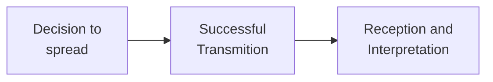

From Wikipedia:

> Memetics is a theory of the evolution of culture based on Darwinian principles with the meme as the unit of culture. The term "meme" was coined by biologist Richard Dawkins in his 1976 book The Selfish Gene... Dawkins proposed that the same process drives cultural evolution, and he called this second replicator the "meme"... Like genes, memes are selfish replicators and have causal efficacy; in other words, their properties influence their chances of being copied and passed on. Some succeed because they are valuable or useful to their human hosts while others are more like viruses.

The gist is simple. Ideas are born in human minds and spread through the population when we explain them to each other. In this environment, variation (intentional modification or misinterpreting), heritability (after I explain it, the idea in my head is probably a lot like the idea in your head), and differential success (some ideas get spread a lot more than others). So, we should expect evolution to be acting on ideas-in-heads.

Sometimes all ideas are refered to as memes, but sometimes the word is reserved for ideas that are particularly adept at propogation. If we use this sense of the word, the opposite is an antimeme. The is an idea that for whatever reason is particularly inept at propogation. (Modulo the typical issues with ascribing agency in evolutionary thought, you can fill in your own caveats here.)

Typical examples of ideas that are antimemetic for reasons orthogonal to their truth value are taboo concepts and passwords (also [biblically accurate angels and psychoanalysis](https://www.astralcodexten.com/p/book-review-sadly-porn)). The idea of an antimeme was popularized by pseudonymous author qntm in their serialized webfiction, [There is no Antimemetics Division](https://scp-wiki.wikidot.com/antimemetics-division-hub).

To understand an idea as a meme is to understand it in terms of its ability to propogate through a population. For the most part, we care about ideas for their instrumental or truth value. It's a familiar idea that true ideas are not always popular, but the troubling nuance introduced by the concepts of memetics is that we might not ever even encounter the true ideas. For this reason, the study of antimemes is potentially quite important. What true ideas do we miss simply because we are never exposed to them?

### Modeling Idea Spread

The difficulty with studying antimemes should be obvious: it's very hard to come up with examples. So, instead of starting with a list of antimemes and making generalizations, it might be more helpful to study directly the process by which ideas spread.

A simple model of memetic propogation could be as follows. For an idea to spread from me to you, I have to decide to tell you the idea, the idea has to be successfully transmitted, and you have to successfully receive and interpret the idea.

So, we can break the problem up into three subproblems:

1. What ideas do people choose to spread?
2. What ideas are successfuly transmitted?
3. What ideas are successfully received and interpreted?

The best model I know of for addressing the first question is the [simulacrum levels](https://www.lesswrong.com/w/simulacrum-levels). The second question is the domain of [information theory](https://en.wikipedia.org/wiki/Information_theory), which addressed problems of how (mathematical) information is communicated. For the third question, I think the most relevant answer in our age is one involving social media recommendation engines, as these can have many orders of magnitude of impact on how many people are exposed to a given message.

The program I propose for understanding memetics and antimemetics is to compose models of each of these three steps into one model of idea propogation.

*This is a project I'm currently working on. I'll continue to update this article as I make progress.*